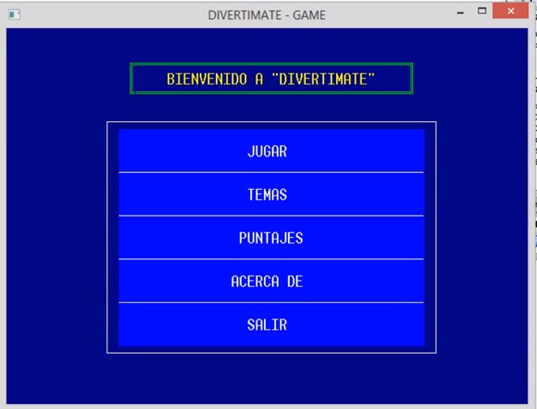
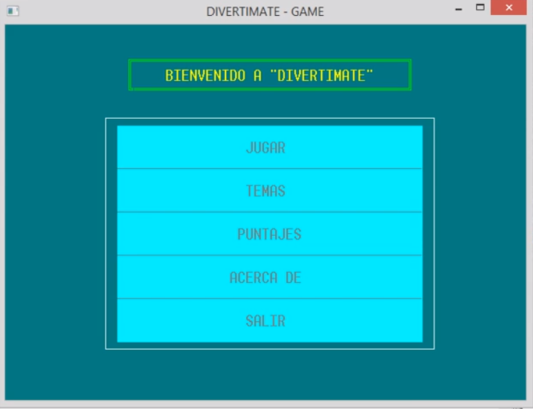
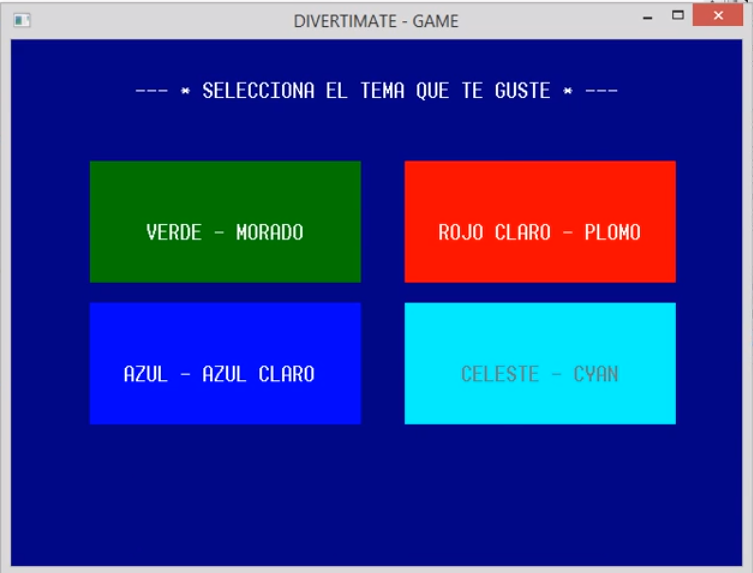
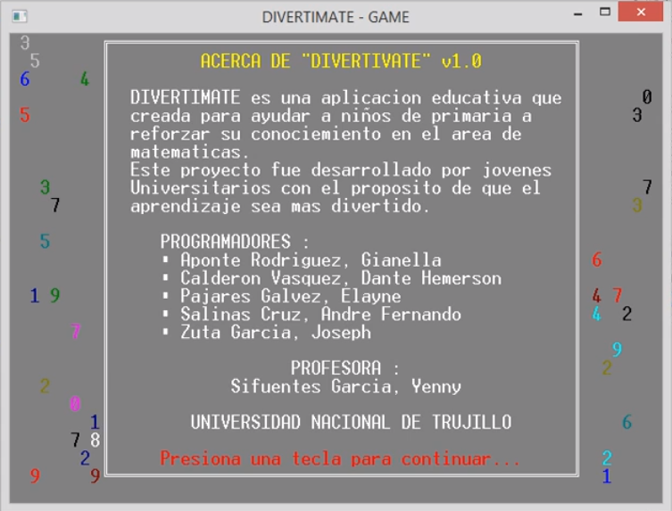
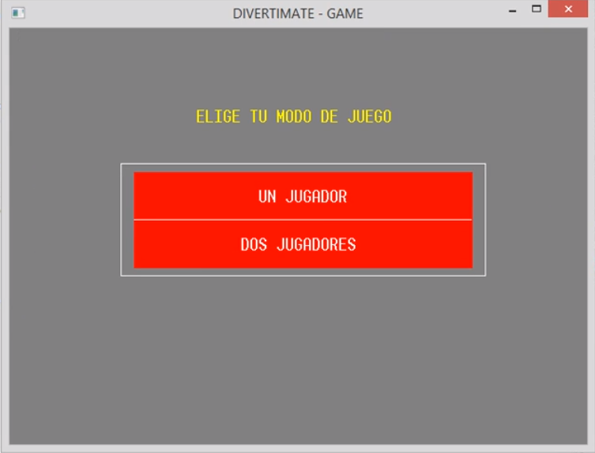
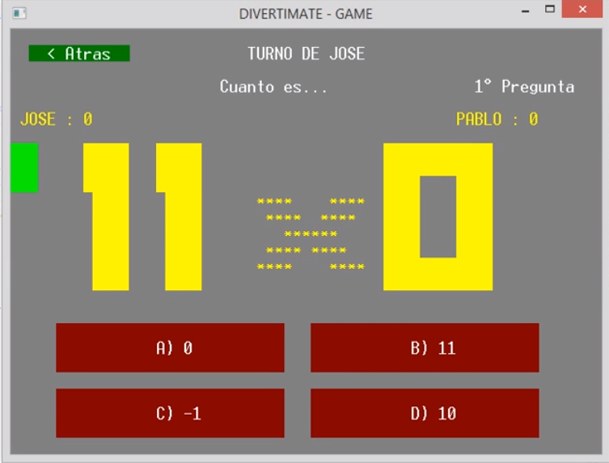
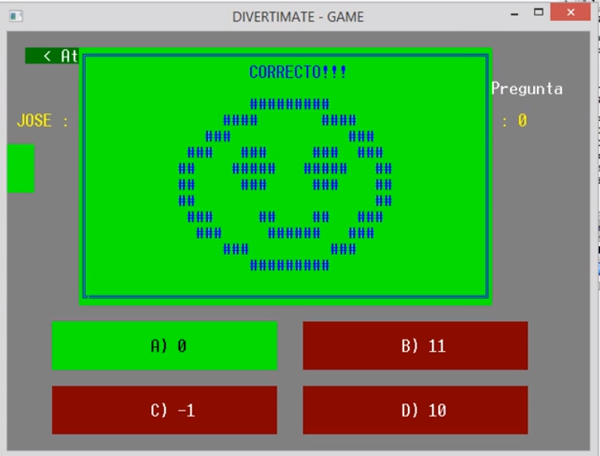
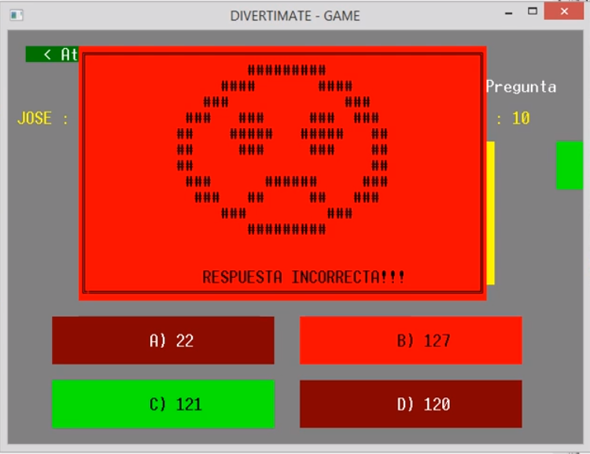
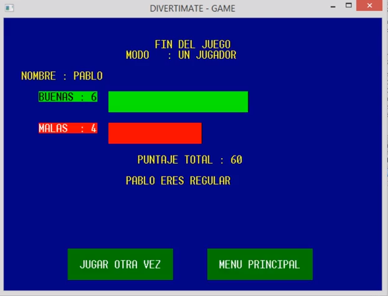

# MateGame
**Mate Game** :1234: es una aplicación educativa creada para ayudar a niños :boy:
 de primaria a reforzar
su conocimiento en el area de **matematicas**.
Este proyecto fue realizado por estudiantes universitarios con el proposito de que
el aprendizaje sea más divertido.

**Espero que lo difruten ñiños :smiley: :+1: **

Puedes ver la [Demo](https://www.youtube.com/watch?v=aTNdjzOQTGU) en youtube.

### Screenshots

